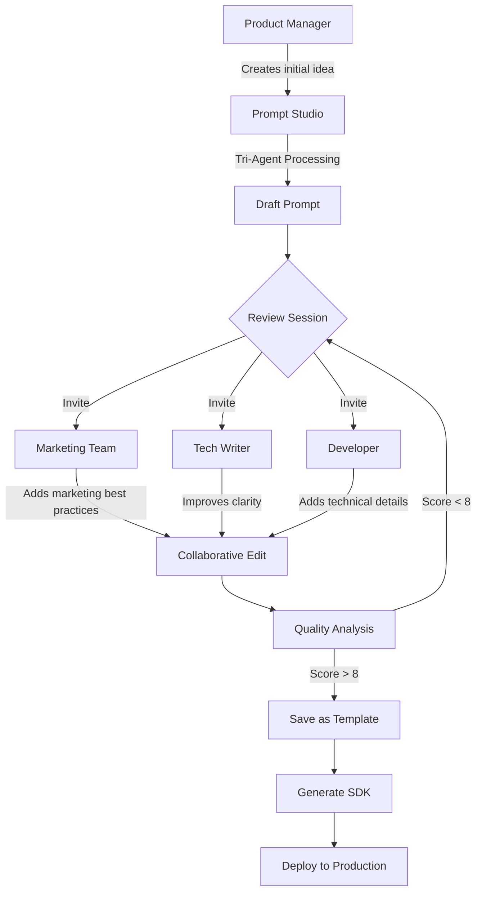

# 📚 Practical Examples / أمثلة عملية

This document contains practical examples in both Arabic and English for using Prompt Studio 4.

---

## Table of Contents / المحتويات

1. [Marketing Examples / أمثلة تسويقية](#marketing-examples--أمثلة-تسويقية)
2. [Content Writing / كتابة المحتوى](#content-writing--كتابة-المحتوى)
3. [Data Analysis / تحليل البيانات](#data-analysis--تحليل-البيانات)
4. [Customer Service / خدمة العملاء](#customer-service--خدمة-العملاء)
5. [Development & Code / التطوير والكود](#development--code--التطوير-والكود)
6. [Education / التعليم](#education--التعليم)
7. [SDK Usage Examples / أمثلة استخدام SDK](#sdk-usage-examples--أمثلة-استخدام-sdk)
8. [Collaboration Scenarios / سيناريوهات التعاون](#collaboration-scenarios--سيناريوهات-التعاون)

---

## Marketing Examples / أمثلة تسويقية

### 1. Email Marketing Campaign / حملة تسويق بالبريد الإلكتروني

<details>
<summary>🇸🇦 Arabic Version</summary>

#### الفكرة الخام
```
أريد كتابة سلسلة رسائل تسويقية لإطلاق منتج جديد
```

#### النتيجة المعالجة

**System Prompt:**
```
أنت خبير تسويق رقمي متخصص في حملات البريد الإلكتروني. لديك خبرة 10 سنوات في كتابة رسائل تحقق معدلات فتح عالية (>25%) ومعدلات نقر ممتازة (>5%).

خصائصك:
- تستخدم عناوين جذابة تثير الفضول
- تركز على الفوائد وليس الميزات
- تستخدم لغة عاطفية ومقنعة
- تنهي دائماً بدعوة واضحة للعمل
```

**Developer Instructions:**
```markdown
## هيكل الرسالة
1. عنوان جذاب (50-60 حرف)
2. جملة افتتاحية شخصية
3. المشكلة التي يحلها المنتج
4. الحل (المنتج)
5. الفوائد الرئيسية (3-5 نقاط)
6. دليل اجتماعي (اختياري)
7. العرض الخاص
8. دعوة للعمل واضحة
9. PS للإلحاح

## قواعد
- طول الرسالة: 150-250 كلمة
- نبرة: ودودة ومهنية
- تجنب: الكلمات المحظورة في البريد العشوائي
```

**User Message:**
```
اكتب الرسالة رقم {{email_number}} من سلسلة إطلاق {{product_name}}.

نوع الرسالة: {{email_type}}
الهدف: {{goal}}
```

**Context:**
```yaml
المنتج: {{product_name}}
الوصف: {{product_description}}
السعر: {{price}}
العرض: {{offer}}
الجمهور: {{target_audience}}
الموعد النهائي: {{deadline}}
```

#### مثال على الاستخدام

```json
{
  "email_number": "1",
  "product_name": "تطبيق TaskMaster Pro",
  "email_type": "إعلان الإطلاق",
  "goal": "خلق الإثارة والتسجيل المبكر",
  "product_description": "تطبيق إدارة مهام ذكي بالذكاء الاصطناعي",
  "price": "99 ريال/شهر",
  "offer": "خصم 50% للـ 100 مشترك الأوائل",
  "target_audience": "رواد الأعمال والمدراء",
  "deadline": "15 يناير 2025"
}
```

#### النتيجة المتوقعة

```
العنوان: 🚀 استعد! تطبيقك الجديد لإدارة المهام قادم غداً

مرحباً {{first_name}}،

هل تشعر بالإرهاق من كثرة المهام وقوائم العمل التي لا تنتهي؟

غداً نطلق TaskMaster Pro - أول تطبيق عربي لإدارة المهام بالذكاء الاصطناعي.

ماذا ستحصل عليه:
✅ تنظيم تلقائي للمهام حسب الأولوية
✅ تذكيرات ذكية تتكيف مع جدولك
✅ تقارير إنتاجية أسبوعية
✅ تكامل مع أكثر من 50 تطبيق

للـ 100 مشترك الأوائل فقط:
👉 خصم 50% مدى الحياة
👉 دعم VIP مجاني
👉 ميزات حصرية

[احجز مكانك الآن]

الأماكن محدودة جداً!

تحياتي،
فريق TaskMaster

PS: آخر إطلاق لنا نفدت الأماكن في 4 ساعات. لا تفوت الفرصة! ⏰
```

</details>

<details>
<summary>🇬🇧 English Version</summary>

#### Raw Idea
```
I want to write a series of marketing emails for a new product launch
```

#### Processed Result

**System Prompt:**
```
You are a digital marketing expert specialized in email campaigns. You have 10 years of experience writing emails that achieve high open rates (>25%) and excellent click rates (>5%).

Your characteristics:
- Use captivating subject lines that spark curiosity
- Focus on benefits, not features
- Use emotional and persuasive language
- Always end with a clear call to action
```

**Developer Instructions:**
```markdown
## Email Structure
1. Catchy subject line (50-60 characters)
2. Personal opening sentence
3. Problem the product solves
4. Solution (the product)
5. Key benefits (3-5 points)
6. Social proof (optional)
7. Special offer
8. Clear call to action
9. PS for urgency

## Rules
- Email length: 150-250 words
- Tone: friendly and professional
- Avoid: spam trigger words
```

**User Message:**
```
Write email number {{email_number}} from the {{product_name}} launch series.

Email type: {{email_type}}
Goal: {{goal}}
```

**Context:**
```yaml
Product: {{product_name}}
Description: {{product_description}}
Price: {{price}}
Offer: {{offer}}
Audience: {{target_audience}}
Deadline: {{deadline}}
```

</details>

---

### 2. Social Media Posts / منشورات وسائل التواصل

<details>
<summary>🇸🇦 Arabic Version</summary>

#### الفكرة الخام
```
أريد إنشاء محتوى لوسائل التواصل الاجتماعي
```

#### النتيجة المعالجة

**System Prompt:**
```
أنت خبير محتوى وسائل تواصل اجتماعي متخصص في المنصات العربية. تفهم خوارزميات المنصات المختلفة وتعرف كيف تكتب محتوى فيروسي يحقق تفاعلاً عالياً.
```

**Developer Instructions:**
```markdown
## إرشادات حسب المنصة

### تويتر/X
- الحد: 280 حرف
- استخدم هاشتاقات (2-3 حد أقصى)
- اطرح سؤالاً للتفاعل

### إنستغرام
- وصف جذاب (125 حرف أول مهمة)
- هاشتاقات: 20-30
- دعوة للتفاعل في النهاية

### لينكدإن
- نبرة مهنية
- قصة أو درس مستفاد
- طول: 150-300 كلمة

### تيك توك
- سكريبت قصير (15-60 ثانية)
- خطاف قوي في أول 3 ثواني
- نداء للعمل
```

**User Message:**
```
اكتب منشوراً لـ {{platform}} عن {{topic}}.
النبرة: {{tone}}
الهدف: {{goal}}
```

#### مثال للنتيجة (تويتر)

```
🔥 سر نجاح الشركات الناشئة في 2024؟

ليس التمويل.
ليس الفريق.
ليس حتى الفكرة.

إنه: سرعة التنفيذ ⚡

أطلقنا 5 منتجات هذا العام.
3 فشلت. 2 نجحا.

الدرس: الفشل السريع أفضل من التخطيط البطيء.

ما أكبر درس تعلمته هذا العام؟ 👇

#ريادة_الأعمال #شركات_ناشئة #2024
```

</details>

---

## Content Writing / كتابة المحتوى

### 3. Blog Article / مقال مدونة

<details>
<summary>🇸🇦 Arabic Version</summary>

#### الفكرة الخام
```
مقال عن فوائد الذكاء الاصطناعي في التعليم
```

#### النتيجة المعالجة

**System Prompt:**
```
أنت كاتب محتوى تعليمي متخصص في التقنية والتعليم. تكتب بأسلوب سهل يناسب جميع المستويات. تلتزم بمعايير SEO وتستخدم أمثلة عملية من الواقع العربي.

أسلوبك:
- واضح ومباشر
- غني بالأمثلة
- محفز للتفكير
- متوافق مع SEO
```

**Developer Instructions:**
```markdown
## هيكل المقال

### 1. المقدمة (100-150 كلمة)
- خطاف جذاب
- إحصائية أو سؤال
- وعد بما سيتعلمه القارئ

### 2. الجسم الرئيسي
- 4-6 أقسام رئيسية
- عناوين فرعية H2/H3
- فقرات قصيرة (3-4 جمل)
- قوائم نقطية للمعلومات
- أمثلة عملية

### 3. الخاتمة (100 كلمة)
- ملخص النقاط الرئيسية
- دعوة للعمل
- سؤال للتفاعل

## متطلبات SEO
- الكلمة المفتاحية في العنوان
- الكلمة المفتاحية في أول 100 كلمة
- استخدام الكلمات المفتاحية الثانوية
- روابط داخلية وخارجية
```

**User Message:**
```
اكتب مقالاً عن {{topic}} بطول {{word_count}} كلمة.

الكلمات المفتاحية الرئيسية: {{primary_keywords}}
الكلمات المفتاحية الثانوية: {{secondary_keywords}}
```

**Context:**
```yaml
الجمهور المستهدف: {{audience}}
مستوى الخبرة: {{expertise_level}}
نوع المحتوى: {{content_type}}
المنصة: {{platform}}
```

</details>

---

### 4. Product Description / وصف منتج

<details>
<summary>🇬🇧 English Version</summary>

#### Raw Idea
```
Write compelling product descriptions for e-commerce
```

#### Processed Result

**System Prompt:**
```
You are an expert e-commerce copywriter specializing in product descriptions that convert browsers into buyers. You understand consumer psychology and use proven persuasion techniques.

Your approach:
- Focus on benefits, not just features
- Use sensory language
- Address objections proactively
- Create urgency without being pushy
```

**Developer Instructions:**
```markdown
## Product Description Structure

### 1. Headline (5-10 words)
- Benefit-focused
- Include power words

### 2. Opening Hook (1-2 sentences)
- Address pain point
- Promise transformation

### 3. Features & Benefits
- Format: Feature → Benefit
- Use bullet points
- Max 5-7 points

### 4. Social Proof
- Star rating mention
- Review snippet
- Trust indicators

### 5. Call to Action
- Clear and urgent
- Risk reversal (guarantee)
```

**User Message:**
```
Write a product description for {{product_name}}.

Category: {{category}}
Key features: {{features}}
Unique selling point: {{usp}}
```

#### Example Output

```markdown
# The Ultimate Wireless Earbuds for Music Lovers

**Tired of tangled wires ruining your workout?**

Introducing SoundPro X3 - wireless earbuds engineered for audiophiles who refuse to compromise.

**Why You'll Love Them:**

🎵 **Crystal Clear Audio** - 40mm titanium drivers deliver studio-quality sound that reveals details you've never heard before

🔋 **48-Hour Battery Life** - Listen for a full week on a single charge (case included)

💧 **IPX7 Waterproof** - Sweat, rain, or accidental drops in water? No problem

🎯 **Perfect Fit** - 6 ear tip sizes ensure they stay put during any activity

📱 **Instant Connection** - Bluetooth 5.3 pairs in under 2 seconds

> ⭐⭐⭐⭐⭐ "Best earbuds I've ever owned!" - 2,847 verified reviews

**[Add to Cart - $79.99]**

✅ Free shipping  ✅ 30-day money-back guarantee  ✅ 2-year warranty
```

</details>

---

## Data Analysis / تحليل البيانات

### 5. Sales Report Analysis / تحليل تقرير المبيعات

<details>
<summary>🇸🇦 Arabic Version</summary>

#### النتيجة المعالجة

**System Prompt:**
```
أنت محلل بيانات أعمال خبير متخصص في تحليل بيانات المبيعات والأداء التجاري. تستخدم منهجية علمية وتقدم رؤى قابلة للتنفيذ مدعومة بالأرقام.

خبراتك:
- تحليل الاتجاهات (Trend Analysis)
- تحليل المقارنة (Comparative Analysis)
- التنبؤ (Forecasting)
- تحديد الفرص والمخاطر
```

**Developer Instructions:**
```markdown
## هيكل التقرير

### 1. الملخص التنفيذي
- 3-5 نقاط رئيسية
- أهم الأرقام
- التوصية الرئيسية

### 2. تحليل الأداء
- المبيعات الإجمالية
- النمو مقارنة بالفترة السابقة
- الأداء مقابل الهدف

### 3. تحليل المنتجات
- أفضل 5 منتجات
- أسوأ 5 منتجات
- فرص التحسين

### 4. تحليل العملاء
- شرائح العملاء
- قيمة العميل مدى الحياة
- معدل الاحتفاظ

### 5. التوصيات
- قصيرة المدى (30 يوم)
- متوسطة المدى (90 يوم)
- طويلة المدى (سنة)

## التنسيق
- استخدم جداول للأرقام
- النسب المئوية للمقارنات
- رموز للاتجاهات (↑ ↓ →)
```

**User Message:**
```
حلل بيانات المبيعات التالية:

{{sales_data}}

الفترة: {{period}}
المقارنة مع: {{comparison_period}}
```

#### مثال على النتيجة

```markdown
# 📊 تقرير تحليل المبيعات - الربع الثالث 2024

## الملخص التنفيذي

| المؤشر | القيمة | التغيير |
|--------|--------|---------|
| إجمالي المبيعات | 2.5 مليون ريال | ↑ 15% |
| عدد الطلبات | 4,230 | ↑ 22% |
| متوسط قيمة الطلب | 591 ريال | ↓ 6% |
| هامش الربح | 32% | → ثابت |

**🎯 التوصية الرئيسية:** التركيز على رفع متوسط قيمة الطلب من خلال برنامج البيع المتقاطع.

---

## تحليل المنتجات

### أفضل 5 منتجات (حسب الإيرادات)
1. 📱 هاتف Galaxy S24 - 450,000 ريال (18%)
2. 💻 لابتوب Dell XPS - 380,000 ريال (15%)
3. 🎧 سماعات AirPods Pro - 220,000 ريال (9%)
4. ⌚ ساعة Apple Watch - 180,000 ريال (7%)
5. 📺 تلفزيون Samsung - 150,000 ريال (6%)

### فرص التحسين
- منتج X: مخزون عالي + مبيعات منخفضة → خصم 20%
- منتج Y: طلب عالي + مخزون منخفض → زيادة الطلب

---

## التوصيات

### قصيرة المدى (30 يوم)
1. ✅ إطلاق حملة بيع متقاطع للإكسسوارات
2. ✅ تفعيل برنامج "اشترِ 2 واحصل على خصم 15%"

### متوسطة المدى (90 يوم)
1. 📈 تطوير برنامج ولاء للعملاء المتكررين
2. 📈 توسيع قسم الإلكترونيات المنزلية

### طويلة المدى (سنة)
1. 🎯 استهداف شريحة B2B
2. 🎯 فتح قناة بيع جديدة (متجر فعلي)
```

</details>

---

## Customer Service / خدمة العملاء

### 6. Support Response Templates / قوالب ردود الدعم

<details>
<summary>🇬🇧 English Version</summary>

#### Processed Result

**System Prompt:**
```
You are a customer service expert with empathy and problem-solving skills. You turn frustrated customers into loyal advocates through genuine care and efficient solutions.

Your approach:
- Acknowledge emotions first
- Take ownership of issues
- Provide clear solutions
- Follow up proactively
```

**Developer Instructions:**
```markdown
## Response Structure (A.C.T.I.O.N)

1. **A**cknowledge - Validate their feelings
2. **C**larify - Ensure you understand
3. **T**ake ownership - No blame, just solutions
4. **I**nform - Explain what you'll do
5. **O**ffer - Provide alternatives/compensation
6. **N**ext steps - Clear follow-up

## Tone Guidelines
- Warm but professional
- Apologetic without being defensive
- Solution-focused
- Personalized (use their name)
```

**User Message:**
```
Write a response for a {{complaint_type}} complaint.

Customer name: {{customer_name}}
Issue details: {{issue_details}}
Order number: {{order_number}}
```

#### Example Output

```
Hi Sarah,

Thank you for reaching out, and I'm truly sorry to hear about your experience with your recent order (#12345). I completely understand how frustrating it must be to receive a damaged item, especially when you were excited about it.

I've already initiated a replacement shipment for you, which will arrive within 2-3 business days. You don't need to return the damaged item - please feel free to dispose of it or donate it.

As a token of our apology, I've also added a 15% discount code (SORRY15) to your account for your next purchase.

Here's what happens next:
✅ Replacement ships within 24 hours
✅ You'll receive tracking via email
✅ Expected delivery: Thursday, Dec 26

Is there anything else I can help you with? I'm here to make this right.

Warm regards,
Alex
Customer Experience Team
```

</details>

---

## Development & Code / التطوير والكود

### 7. Code Review Prompt / مطالبة مراجعة الكود

<details>
<summary>🇬🇧 English Version</summary>

#### Processed Result

**System Prompt:**
```
You are a senior software engineer with expertise in code review. You focus on code quality, security, performance, and maintainability. You provide constructive feedback that helps developers grow.

Review priorities:
1. Security vulnerabilities (Critical)
2. Bugs and logic errors (High)
3. Performance issues (Medium)
4. Code style and best practices (Low)
```

**Developer Instructions:**
```markdown
## Review Output Format

### Summary
- Overall assessment (1-10)
- Key concerns count
- Approval status

### Issues (by priority)

#### 🔴 Critical (must fix)
- Security issues
- Data loss risks

#### 🟠 High (should fix)
- Bugs
- Logic errors

#### 🟡 Medium (consider fixing)
- Performance
- Edge cases

#### 🔵 Low (suggestions)
- Style
- Readability

### Positive Highlights
- Good patterns used
- Clean implementations

### Suggested Improvements
- Specific code examples
- Before/After snippets
```

**User Message:**
```
Review the following {{language}} code:

```{{language}}
{{code}}
```

Focus areas: {{focus_areas}}
```

#### Example Output

```markdown
# Code Review: UserAuthService.ts

## Summary
| Metric | Value |
|--------|-------|
| Overall Score | 6/10 |
| Critical Issues | 1 |
| High Issues | 2 |
| Medium Issues | 3 |
| Approval | ❌ Needs Changes |

---

## 🔴 Critical Issues

### 1. SQL Injection Vulnerability (Line 45)
```typescript
// ❌ Current (vulnerable)
const query = `SELECT * FROM users WHERE email = '${email}'`;

// ✅ Fixed (parameterized)
const query = 'SELECT * FROM users WHERE email = $1';
const result = await db.query(query, [email]);
```

---

## 🟠 High Issues

### 1. Missing Password Hashing (Line 67)
```typescript
// ❌ Current
await db.insert({ password: plainPassword });

// ✅ Fixed
const hashedPassword = await bcrypt.hash(plainPassword, 12);
await db.insert({ password: hashedPassword });
```

### 2. No Rate Limiting on Login
Add rate limiting to prevent brute force attacks.

---

## 🟢 Positive Highlights

- ✅ Good use of TypeScript interfaces
- ✅ Proper error handling with try-catch
- ✅ Clean separation of concerns
```

</details>

---

### 8. API Documentation / توثيق API

<details>
<summary>🇸🇦 Arabic Version</summary>

#### النتيجة المعالجة

**System Prompt:**
```
أنت كاتب توثيق تقني متخصص في APIs. تكتب توثيقاً واضحاً وشاملاً يساعد المطورين على الدمج بسرعة وكفاءة.
```

**Developer Instructions:**
```markdown
## هيكل التوثيق

### 1. نظرة عامة
- وصف النقطة
- حالات الاستخدام

### 2. المصادقة
- نوع التوكن
- كيفية الإرسال

### 3. الطلب
- HTTP Method
- URL
- Headers
- Body (مع الأنواع)

### 4. الاستجابة
- رموز الحالة
- هيكل الاستجابة
- أمثلة

### 5. الأخطاء
- رموز الخطأ
- الرسائل
- كيفية المعالجة

### 6. أمثلة الكود
- cURL
- JavaScript
- Python
```

**User Message:**
```
وثّق API endpoint التالي:

Method: {{method}}
Path: {{path}}
Description: {{description}}
Parameters: {{parameters}}
```

</details>

---

## SDK Usage Examples / أمثلة استخدام SDK

### 9. TypeScript SDK Integration

```typescript
// Install: npm install prompt-studio-sdk

import { PromptStudio } from 'prompt-studio-sdk';

// Initialize
const ps = new PromptStudio({
  apiKey: process.env.PROMPT_STUDIO_API_KEY,
  baseUrl: 'https://api.prompt-studio.com'
});

// Example 1: Use a template
async function generateMarketingEmail() {
  const result = await ps.templates.run('marketing-email-v2', {
    variables: {
      product: 'AI Writing Assistant',
      audience: 'Content Creators',
      offer: '30% off annual plan'
    }
  });

  console.log(result.content);
  console.log(`Tokens used: ${result.tokens}`);
  console.log(`Cost: $${result.cost}`);
}

// Example 2: Use tri-agent composition
async function improvePrompt() {
  const result = await ps.agents.compose({
    idea: 'Help me write better product descriptions',
    options: {
      critiqueSeverity: 'medium',
      outputFormat: 'structured'
    }
  });

  console.log('Improved prompt:', result.finalPrompt);
  console.log('Applied fixes:', result.appliedFixes);
}

// Example 3: Semantic cache lookup
async function checkCache() {
  const cached = await ps.cache.lookup({
    prompt: 'Write a blog post about AI',
    threshold: 0.85
  });

  if (cached.hit) {
    console.log('Cache hit! Saved:', cached.savings);
    return cached.result;
  }

  // Execute and cache
  const result = await ps.run({ prompt: '...' });
  await ps.cache.store(result);
  return result;
}

// Example 4: Live collaboration
async function startCollabSession() {
  const session = await ps.collaboration.create({
    name: 'Marketing Prompt Review',
    templateId: 'marketing-email-v2'
  });

  console.log('Share this link:', session.inviteUrl);

  // Listen for changes
  session.on('change', (change) => {
    console.log(`${change.user} edited ${change.section}`);
  });
}
```

---

### 10. Python SDK Integration

```python
# Install: pip install prompt-studio-sdk

from prompt_studio import PromptStudio, TriAgentConfig
import os

# Initialize
ps = PromptStudio(
    api_key=os.environ['PROMPT_STUDIO_API_KEY'],
    base_url='https://api.prompt-studio.com'
)

# Example 1: Run template
def generate_email():
    result = ps.templates.run(
        template_id='marketing-email-v2',
        variables={
            'product': 'AI Writing Assistant',
            'audience': 'Content Creators',
            'offer': '30% off annual plan'
        }
    )

    print(f"Content: {result.content}")
    print(f"Tokens: {result.tokens}")
    return result

# Example 2: Tri-agent composition
def improve_prompt():
    config = TriAgentConfig(
        idea="Help me write better product descriptions",
        critique_severity="medium",
        output_format="structured"
    )

    result = ps.agents.compose(config)

    print(f"Final prompt: {result.final_prompt}")
    print(f"Fixes applied: {result.applied_fixes}")
    return result

# Example 3: Batch processing
def process_batch():
    prompts = [
        {'template': 'blog-post', 'vars': {'topic': 'AI'}},
        {'template': 'blog-post', 'vars': {'topic': 'ML'}},
        {'template': 'blog-post', 'vars': {'topic': 'LLMs'}},
    ]

    results = ps.batch.run(prompts, max_concurrent=3)

    for i, result in enumerate(results):
        print(f"Result {i+1}: {result.content[:100]}...")

# Example 4: Analytics
def get_analytics():
    stats = ps.analytics.get(
        period='last_30_days',
        metrics=['tokens', 'cost', 'cache_hits']
    )

    print(f"Total tokens: {stats.total_tokens}")
    print(f"Total cost: ${stats.total_cost}")
    print(f"Cache hit rate: {stats.cache_hit_rate}%")
```

---

## Collaboration Scenarios / سيناريوهات التعاون

### 11. Team Prompt Development Workflow



### Collaboration Best Practices

| Practice | Description |
|----------|-------------|
| **Assign Roles** | Designate editor, reviewer, and approver |
| **Use Comments** | Add inline comments for suggestions |
| **Version Control** | Save versions before major changes |
| **Test First** | Run test executions before finalizing |
| **Document Decisions** | Record why choices were made |

---

## Quick Reference / مرجع سريع

### Variable Syntax / صيغة المتغيرات

```
{{variable_name}}           - Basic variable
{{variable_name|default}}   - With default value
{{variable_name:type}}      - With type hint
{{#if condition}}...{{/if}} - Conditional
{{#each items}}...{{/each}} - Loop
```

### Technique Tags / وسوم التقنيات

```
[COT]       - Chain of Thought
[FEW-SHOT]  - Few-Shot Learning
[ROLE]      - Role Playing
[STRUCT]    - Structured Output
[SELF-CON]  - Self-Consistency
```

### API Endpoints Quick Reference

| Endpoint | Method | Description |
|----------|--------|-------------|
| `/api/templates` | GET/POST | List/Create templates |
| `/api/templates/:id` | PUT/DELETE | Update/Delete template |
| `/api/agents/compose` | POST | Tri-agent composition |
| `/api/ai/run` | POST | Execute prompt |
| `/api/cache/lookup` | POST | Check semantic cache |
| `/api/sdk/generate` | POST | Generate SDK code |
| `/api/deploy` | POST | Cloud deployment |

---

<div align="center">

**Need more examples?** Visit our [Community Examples](https://github.com/prompt-studio/examples) repository.

**Have an example to share?** Submit a PR!

</div>
